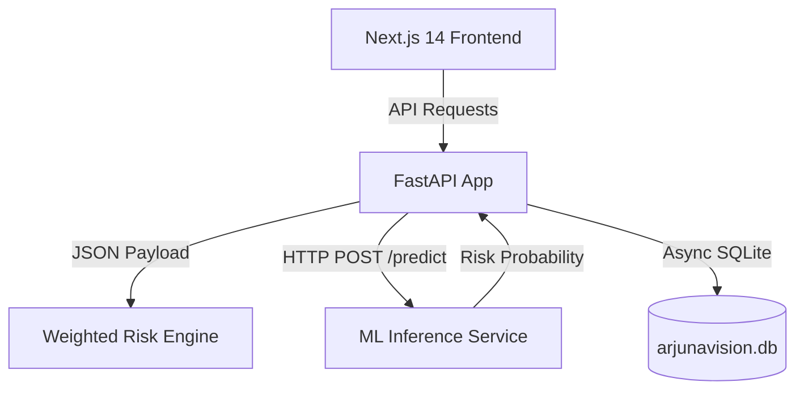

# 🛡️ ArjunaVision — AI-Powered Personal Safety Platform

ArjunaVision is a production-style, hackathon-ready personal safety and emergency-response platform. It integrates manual/voice SOS, location history, fall detection, health monitoring, and explainable AI-based risk scoring with a real-time guardian/family dashboard.

## 🚀 Key Features

*   **Safety Pipeline:** Continuous loop: `MONITOR → DETECT → VERIFY → ASSESS → LOCATE → ALERT → ASSIST → TRACK → RECOVER`.
*   **Explainable AI Risk Engine:** Evaluates multiple input signals (fall, heart rate, blood oxygen, route deviation, inactivity) to compute a clear 0-100% risk score with transparent reasons.
*   **Dual Emergency Detection:** Press-to-trigger SOS with a 5s countdown, hands-free voice command SOS using speech synthesis, and automatic fall detection.
*   **Dynamic Guardian Dashboard:** Gives loved ones a real-time view of location, safety status, and active emergency logs.
*   **Obsidian Dark Aesthetics:** Beautiful, responsive UI incorporating Stitch Vigilance Modern tokens, glassmorphism, responsive bento grids, and dark maps.

## 🛠️ Architecture & Tech Stack



*   **Frontend:** Next.js 14 (App Router), TailwindCSS, TypeScript, Framer Motion, Zustand, Recharts, Leaflet Maps.
*   **Backend:** FastAPI, Async SQLAlchemy, SQLite (Development) / PostgreSQL (Production), JWT Authentication.
*   **ML Service:** FastAPI, Scikit-learn (Random Forest Classifier).

---

## 🏃 Quick Start (Local Run)

### Prerequisites
*   Node.js v18+
*   Python 3.11+

### 1. Build and Train ML Risk Model
First, generate the synthetic dataset and train the Random Forest model:
```bash
python -m venv .venv
# Activate:
# PowerShell: .venv\Scripts\Activate.ps1
# Bash/GitBash: source .venv/bin/activate

pip install -r backend/requirements.txt -r ml/requirements.txt
python ml/training/train_risk_model.py
```

### 2. Start the Backend API (Port 8000)
```bash
# In backend/ folder (or root using .venv):
uvicorn app.main:app --host 0.0.0.0 --port 8000 --reload
```

### 3. Start the ML Service (Port 8001)
```bash
# In ml/ folder:
uvicorn inference.app:app --host 0.0.0.0 --port 8001 --reload
```

### 4. Run the Next.js Frontend (Port 3000)
```bash
cd frontend
npm install
npm run dev
```
Access the application at `http://localhost:3000`.

---

## 🐳 Running with Docker Compose
To run the entire multi-service stack instantly:
```bash
docker-compose up --build
```
This builds and starts:
1.  **Frontend:** `http://localhost:3000`
2.  **Backend:** `http://localhost:8000`
3.  **ML Service:** `http://localhost:8001`

---

## 📋 Recommended Demo Walkthrough (for Judges)

1.  **Welcome Dashboard:** Register/login with quick credentials (`demo@arjunavision.com` / `demo1234`). Seed realistic demo data via the dashboard banner.
2.  **Health Monitor:** View personal circadian heart rate charts, blood oxygen graphs, and baseline comparison models.
3.  **Live Location Trail:** See current GPS mapping and location history trail on a customized dark-themed Leaflet map.
4.  **AI Insights:** Check the explainable radial risk gauge showing a safe `8/100` score with detailed reasoning list.
5.  **Run Simulation:** Go to the `/demo` page and launch **Scenario 3 (Fall Detection)**. Watch the animated `DETECT → ANALYZE → LOCATE` pipeline update safety states to `EMERGENCY ACTIVE` in real-time.
6.  **Resolve Safety Check:** Acknowledge you are safe to automatically cancel alerts and resume baseline safety monitoring.
